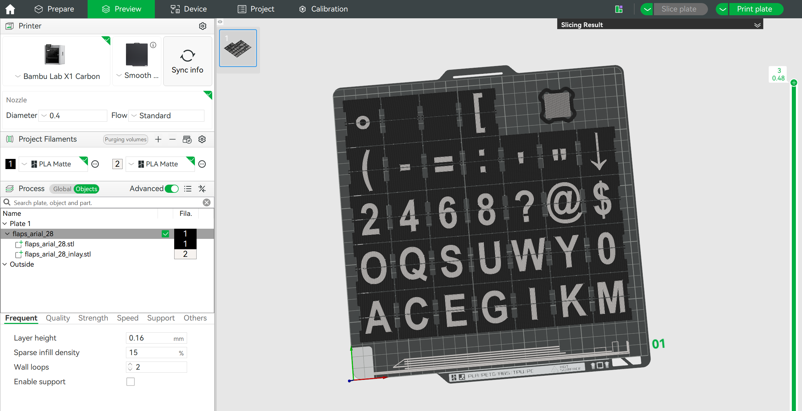

# Flaps generator (`flaps.scad`)

## OpenSCAD (brief)

[OpenSCAD](https://openscad.org/) is a script-based 3D CAD tool: you describe models as code (extrusions, booleans, imports), adjust parameters, then preview or fully render solid geometry and export meshes (e.g. STL). There is no interactive mesh sculpting—changes are edits to the `.scad` file.

## What `flaps.scad` does

The script builds a grid of split-flap blanks matching the outline in `flap.dxf`. For each flap it uses **three adjacent characters** from your sequence (previous / visible / next) so the physical flap matches how letters wrap on a drum.

You control:

- **`font`** — font family and style (OpenSCAD font string, e.g. `Consolas:style=Regular`)
- **`fontsize`** — base letter height passed to OpenSCAD `text()` on each flap face
- **`chars`** — exactly **64 characters** in order; index `0…63` maps to the printed sheet (the loops stop before character index 64)
- **`charSizeOffset`** — Per character adjustment of the size. For example '@' can be make smaller.
- **`charYposOffset`** — Allows X position adjustment per character. The default is to align in the center. But characters like `'` need to be on the top

At the top of `flaps.scad`, `MakeFlaps(1)` produces the flap bodies with letter cutouts; `MakeFlaps(2)` produces only the thin letter inlays for multi-material printing.

## How to use

1. Set **`font`**, **`fontsize`**, **`chars`** (64 characters), and optionally **`charSizeOffset`** / **`charYposOffset`** (each 64 entries, aligned by index with **`chars`**) as needed.
2. **Flap bodies:** Comment out `MakeFlaps(2);` and keep **`MakeFlaps(1);`** active. Run a **full render** (OpenSCAD: **F6**), then **Export → Export as STL**.
3. **Letter inlays:** Comment out `MakeFlaps(1);` and keep **`MakeFlaps(2);`** active. Full render again (**F6**), export a second STL.

   *(Preview-only **F5** is not enough for a clean STL export; always use full render for exports.)*

4. **Bambu Studio:** Import **both** STL files. When prompted, choose **import as a single object** (so both parts stay aligned as one assembly).
5. In the object/plate list, assign **Filament 1** and **Filament 2** to the two bodies so the slicer maps each STL to the correct filament.

Example in Bambu Studio (Preview): one grouped object with body + inlay STLs, each mapped to a filament slot.

License for this generator: see comments in `flaps.scad` (Creative Commons BY-NC-SA 4.0).
